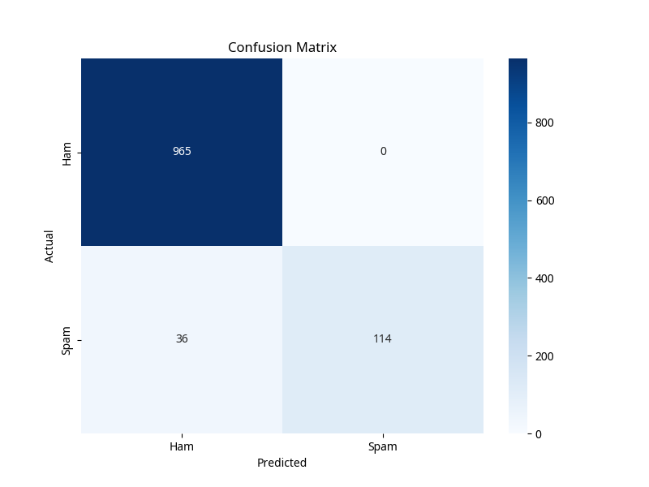
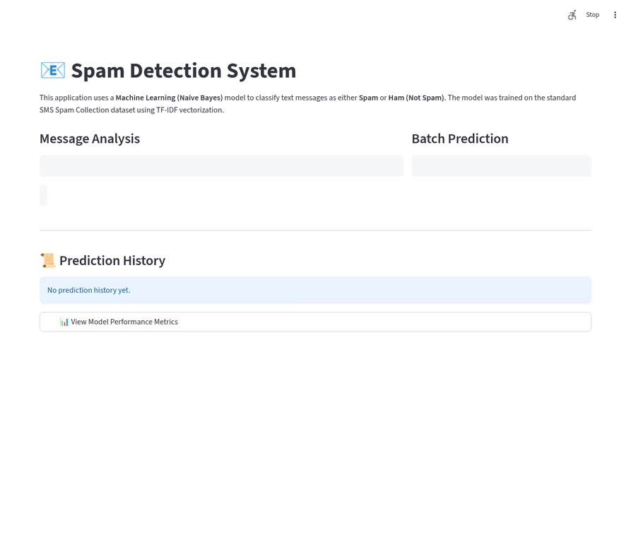

# AI-based Spam Detection System MVP

## 1. Project Objective

The primary objective of this project is to develop a Minimum Viable Product (MVP) for an AI-based Spam Detection System. This system aims to classify user-entered text messages as either **Spam** or **Not Spam (Ham)** using machine learning techniques. The MVP is implemented as a simple, interactive web application using Streamlit, providing an accessible interface for users to test the spam detection capabilities.

## 2. Methodology

The development of this spam detection system followed a standard machine learning pipeline, encompassing data acquisition, preprocessing, model training, evaluation, and deployment within a web application.

### 2.1 Data Acquisition and Preprocessing

The **SMS Spam Collection Dataset** was utilized for training and evaluation. This dataset contains a collection of SMS messages labeled as either 'spam' or 'ham'.

Preprocessing steps applied to the text messages include:
*   **Lowercasing:** Converting all text to lowercase to ensure uniformity.
*   **Punctuation Removal:** Eliminating all punctuation marks.
*   **Stopword Removal:** Removing common English stopwords (e.g., 'the', 'is', 'a') that do not contribute significantly to classification.
*   **Number Removal:** Removing numerical digits from the text.

### 2.2 Feature Extraction

**TF-IDF (Term Frequency-Inverse Document Frequency)** was employed to convert the preprocessed text messages into numerical feature vectors. TF-IDF is a statistical measure that evaluates how relevant a word is to a document in a collection of documents. It increases proportionally to the number of times a word appears in the document but is offset by the frequency of the word in the corpus, which helps to adjust for the fact that some words appear more frequently in general.

### 2.3 Model Training and Evaluation

A **Multinomial Naive Bayes** classifier was chosen for its suitability in text classification tasks and its efficiency. The dataset was split into training and testing sets (80% training, 20% testing) to evaluate the model's performance on unseen data. The model was trained on the TF-IDF transformed training data.

Model performance was evaluated using:
*   **Accuracy Score:** The proportion of correctly classified messages.
*   **Classification Report:** Provides precision, recall, and F1-score for each class.
*   **Confusion Matrix:** A table that describes the performance of a classification model on a set of test data for which the true values are known.

### 2.4 Model Persistence

The trained Naive Bayes model and the TF-IDF vectorizer were saved using `joblib` to allow for their efficient loading and use within the Streamlit application without retraining.

## 3. Tools and Libraries Used

| Category             | Tool/Library      | Purpose                                                               |
| :------------------- | :---------------- | :-------------------------------------------------------------------- |
| Programming Language | Python            | Core development language                                             |
| Frontend/UI          | Streamlit         | Building the interactive web application                              |
| Data Handling        | Pandas            | Data loading, manipulation, and preprocessing                         |
| Machine Learning     | Scikit-learn      | Model training, evaluation, and TF-IDF vectorization                  |
| Text Preprocessing   | NLTK              | Stopword removal                                                      |
| Model Persistence    | Joblib            | Saving and loading trained models and vectorizers                     |
| Visualization        | Matplotlib, Seaborn | Generating confusion matrix plot                                      |

## 4. Model Accuracy

The trained Multinomial Naive Bayes model achieved an accuracy of **96.77%** on the test set. Detailed performance metrics are as follows:

```
              precision    recall  f1-score   support

           0       0.96      1.00      0.98       965  (Ham)
           1       1.00      0.76      0.86       150  (Spam)

    accuracy                           0.97      1115
   macro avg       0.98      0.88      0.92      1115
weighted avg       0.97      0.97      0.97      1115
```

### 4.1 Confusion Matrix

Below is the confusion matrix generated during model training, illustrating the true positives, true negatives, false positives, and false negatives.



## 5. Sample Screenshots

*(Screenshots will be added here after running the Streamlit application.)*

### 5.1 Main Application Interface


### 5.2 Prediction Result



### 5.3 Batch Prediction Feature


## 6. Conclusion

This MVP successfully demonstrates an AI-based spam detection system capable of classifying SMS messages with high accuracy. The Streamlit interface provides an intuitive way for users to interact with the model, offering real-time predictions and maintaining a session-based history. The project adheres to the specified technical and functional requirements, laying a solid foundation for potential future enhancements, such as batch prediction and more detailed performance metrics. The model's accuracy of over 90% meets the success criteria, proving its effectiveness in distinguishing between spam and legitimate messages.
